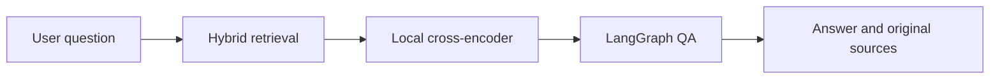
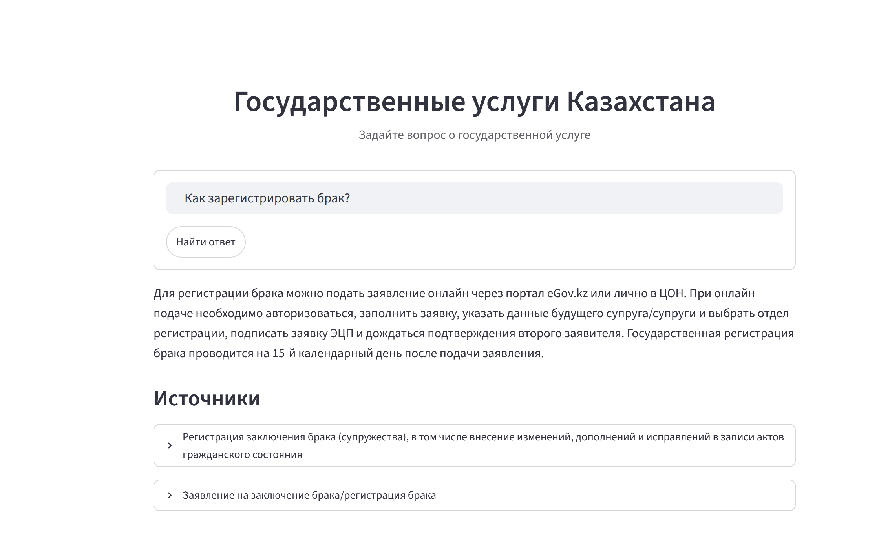

# Kazakhstan eGov RAG

Government-service information is often spread across long pages and difficult to
find with natural-language queries. This proof of concept answers Russian-language
questions about Kazakhstan eGov services and shows the original sources used for
each answer.

The application is deliberately grounded: it retrieves relevant records first,
reranks them locally, and instructs the QA model to answer only from that evidence.
If the evidence is insufficient, it returns a refusal instead of inventing an
answer.

## What it does

- Loads and validates an eGov question-answer workbook.
- Combines semantic and BM25 search with reciprocal-rank fusion.
- Reranks candidates with a local multilingual cross-encoder.
- Uses LangGraph to produce a concise, source-grounded answer.
- Serves a Streamlit interface and a LangServe API.



Embeddings, the search index, and reranking stay local. By default, answer
generation also runs locally through Ollama. An external OpenAI-compatible API
can be enabled when needed.

## Use case example

The user asks how to register a marriage. The application returns a practical,
source-grounded answer and lists the original eGov records used as evidence.



## RAG evaluation

The repository includes a 30-question Russian retrieval set in
`evals/rag_eval_30.jsonl`. It stores questions and relevant document IDs only—not
the source texts or expected answers.

Results for the checked-in configuration, retrieving three documents per query:

| Metric | Result |
| --- | ---: |
| Hit@1 | 70.0% |
| Recall@3 | 86.7% |
| Precision@3 | 28.9% |
| MRR@3 | 0.783 |
| nDCG@3 | 0.805 |
| Mean retrieval latency | 1.72 s |
| P95 retrieval latency | 2.33 s |

These metrics evaluate retrieval, not generated-answer quality. Hardware affects
latency. Reproduce the evaluation with:

```powershell
python eval.py
```

## Docker installation

Docker Compose provides the simplest complete installation. It downloads and
validates the public eGov workbook, downloads the pinned Hugging Face reranker,
pulls the required Ollama models, builds the Chroma index, and then starts the
application:

```powershell
docker compose up --build
```

Open `http://localhost:8501`. The first start can take several minutes because it
downloads model weights and creates the index. Docker volumes preserve the dataset,
reranker, Ollama models, and index for later starts.

The initializers use these public sources:

- [Kazakhstan eGov workbook](https://ashyq.data.gov.kz/dataset/magda-ds-44acd1a0-59d4-45d6-85cc-8c00cde6a748/details?q=)
- [Multilingual cross-encoder reranker](https://huggingface.co/cross-encoder/mmarco-mMiniLMv2-L12-H384-v1)

Local QA is the default and requires no credentials. To use an external
OpenAI-compatible service, change `agent.qa.provider` and `agent.qa.model` in
`config.yaml`, then set `BASE_URL` and `API_KEY` in `.env` before rebuilding.

The default Compose configuration is CPU-compatible. Local QA may be slow on weak
machines; GPU-enabled Ollama can be configured with a Compose override appropriate
for the host platform.

## Local setup

Requirements:

- Python 3.12+
- [Ollama](https://ollama.com/) for local embeddings and default QA generation
- [RAG Dataset](https://ashyq.data.gov.kz/dataset/magda-ds-44acd1a0-59d4-45d6-85cc-8c00cde6a748/details?q=) from AshyqData Portal
- API credentials only when using the optional external QA configuration
- The excluded dataset and reranker files described below

On Windows PowerShell:

```powershell
python -m venv .venv
.\.venv\Scripts\Activate.ps1
python -m pip install -r requirements.txt
ollama pull qwen3-embedding:0.6b
ollama pull qwen3:4b
Copy-Item .env.example .env
```

Provide the following excluded files:

```text
data/egov_ru.xlsx
models/mmarco-mMiniLMv2-L12-h384-v1/
```

### QA model

**Local Ollama is the default QA provider.** The checked-in configuration is:

```yaml
agent:
  qa:
    provider: ollama
    model: qwen3:4b
    request_timeout_seconds: 240
    reasoning_effort: none
    keep_alive: 5m
```

It requires no API key and keeps retrieved evidence and generated answers on the
local machine.

**On machines with limited RAM, VRAM, or CPU capacity, a local QA model can be the
main performance bottleneck.** Use a smaller Ollama model or an external service
when response latency is too high.

To use any service that implements the OpenAI-compatible Chat Completions API,
replace the `agent.qa` section with:

```yaml
agent:
  qa:
    provider: openai
    model: provider-model-name
    request_timeout_seconds: 120
    reasoning_effort: none
```

Then put the external API token in `.env`:

```dotenv
BASE_URL=https://your-provider.example/v1
API_KEY=replace-me
```

If HTTPS traffic passes through a corporate proxy, optionally set `CA_BUNDLE` to
the absolute path of its PEM certificate bundle.

Build the local Chroma index:

```powershell
python create_index.py
```

Start the application:

```powershell
streamlit run serve.py
```

`serve.py` starts the LangServe backend automatically. The API documentation is
available at `http://127.0.0.1:8000/docs`. Runtime settings, including model names,
retrieval thresholds, and server addresses, are grouped under `retrieval`, `agent`,
`observability`, and `app` in `config.yaml`.

## Tests

```powershell
python -m pytest -q
```

The automated tests use fake model responses and a temporary Chroma instance.
They do not require Ollama, an external API, credentials, the source workbook, or
downloaded model files. GitHub Actions runs them on every push and pull request.

## Repository boundaries

The following are intentionally excluded from version control:

- `data/egov_ru.xlsx` and other source datasets
- generated Chroma indexes under `data/chroma/`
- downloaded reranker files under `models/`
- `.env`, API keys, certificates, and other credentials

The empty `data/` and `models/` directories are retained with `.gitkeep` files.
`.env.example` documents variable names without containing secrets.
